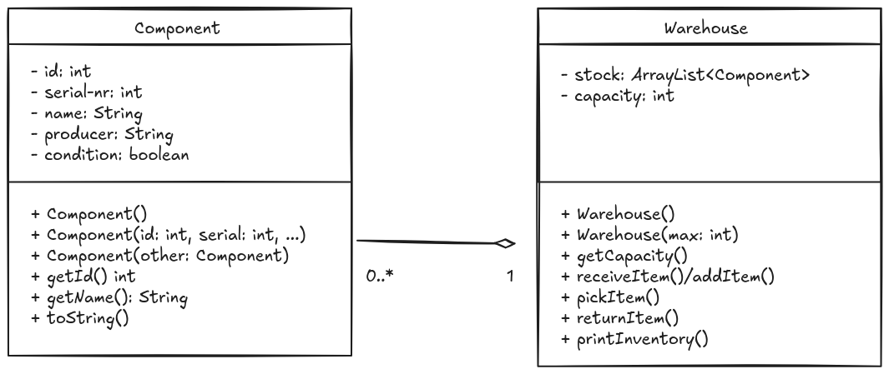

# Aufgaben zum Aufgabenblock II

## 1. Einfache Klassen und Tests mit Tests in diesen Klassen

### 1.1 Datenklasse Student

Du sollst fuer die Hochschule ein Programm fuer die Verwaltung von Studierenden erstellen. Hierfuer erstellst du zunaechst
eine Datenklasse. Diese sollte folgende Attribute beinhalten:

- firstName: String
- lastName: String
- courseOfStudy: String
- age: int >= 0
- matriculationNumber: int
- payedTutionFee: boolean

Die Klasse soll Student heißen. Entwickle zudem folgende Konstruktoren:
- defaultkonstruktor: keine Parameter, allerdings sinnvolle Platzhalter/Standardwerte
- voll qualifizierter Konstruktor
- Copy-Konstruktor

Zudem sollen fuer alle Attribute Getter- und Setter-Methoden erstellt werden.
Entwickle eine `print()` Methode, die den Namen der Klasse, die Namen der Attribute
sowie ihrer Werte ausgibt.

Schreibe ein Programm StudentApp, in welcher du alle Methoden testest.

## 2. Überladen von Konstruktoren und Methoden sowie einfache Aggregationen/Kompositionen

### Aufgabe 2.1 - POJO-Klasse Component

Entwickel eine Klasse Component wie oben beschrieben.

- Es gibt 5 Attribute.
	- Für jedes Attribut soll eine Getter-Methode geschrieben werden
	- für die condition soll eine setter-Methode geschrieben werden
- es sollen 3 überladene Konstruktoren erstellt werden
- es soll eine toString() Methode überschrieben werden

- Erstelle eine main-class ComponentApp und teste alle Methoden.
- erstelle ein array der Größe 5 und speichere 5 Components ab und gib sie mit einer Schleife aus. (du kannst die Components auch via einer Schleife erstellen)

### Aufgabe 2.2 - Klasse Warehouse mit einem Lager für Components als ArrayList

- Ein Warehouse hat eine Standardkapazität von 150 Teilen
- es gibt eine maximale Kapazität und es gibt eine aktuelle Kapazität. Überlege dir eine sinnvolle Systematik, wie du das abbilden kannst und wie du jeweils die maximale und die aktuelle Kapazität abrufen kannst
- Teile können über receiveItem eingebucht werden (solange noch Platz ist)
- über pickItem können Teile ausgebucht/verwendet werden. Dies verringert den aktuellen Bestand, und das Teil sollte entfernt werden
- returnItem ist das einbuchen von Teilen, die schon mal Teil des Lagers waren. Hier muss überprüft werden, ob die Kondition des Teils ausreichend ist, um in das Lager zu kommen. Überlege dir eine Systematik, wie man eine Mindestkondition hinterlegen kann und überprüfen kann, ob das Teil dieser Anforderung entspricht
- printInventory soll eine listartige Ausgabe erzeugen.
- schreibe eine eigene Methode printInvetoryDetailed, welche eine detailliertere Ausgabe als printInventory erzeugt. Verwende hierfür die vorher bereits erstellte Methode toString (der Componenten-Klass)
- erstelle eine WarehouseApp und teste darin alle Methoden des Warehouse. Verwende eventuell loops, um das erstellen von Components zu automatisieren
