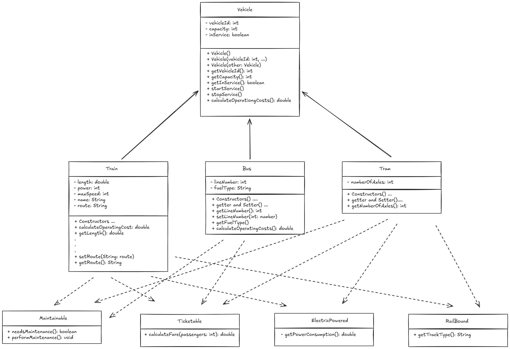

# Aufgaben zum Aufgabenblock III

Die gesamte Klassenstruktur ist im folgenden Bild dargestellt.
In den Teilaufgaben soll diese umgesetzt werden. Teste selbststaendig
den Code und mache sinnvolle Testlaeufe. Ueberlege dir eventuell noch
Erweiterungen.



## 1.0 Abstrakte Klasse

In diesem Schritt soll die Basis-Klasse Vehicle programmiert werden.
Zudem soll die Grundstruktur des Programms definiert werden. Lege dazu
eine VehicleApp und eine Vehicle Datei an. in der App soll die Main-Funktion definiert werden und der Code soll nicht direkt in
der App Datei geschrieben sein.

## 2.0 Subklassen definieren

Hier sollen nun die Unterklassen Train, Bus und Tram implementiert werden.

**Anforderungen:**
- Standard-Konstruktor
- vollqualifizierter Konstruktor
- Kopier-Konstruktor
- fuer alle Attribute soll es getter- und setter-Methoden geben
- implementiere zudem eine sinnvolle Variante der Methoden, die speziell fuer die Klasse sind
- achte auf die richtige Vererbung und die Verwendung von super

### 3.0 Interfaces

Hier sollen nun die einzelnen Interfaces implementiert werden.

**Anforderungen Generell:**
- ueberlege dir eine sinnvolle Implementierung der Methoden

**Interfaces Train:**
- Maintainable
- Ticketable
- ElectricPowered
- RailBound

**Interfaces Bus:**
- Maintainable
- Ticketable

**Interfaces Tram:**
- Maintainable
- Ticketable
- ElectricPowered
- RailBound

**Erweiterungen: **
- Implementiere noch ein weiteres, sinnvolles Interface
    - Ueberlege dir hierfuer mindestens eine sinnvolle Methode und 
      implementiere diese auf mindestens eine Klasse


## 4.0 Textstreams Auslesen und Schreiben

Eine Datei enthaelt Daten zu Fahrzeugen in einem bestimmten Format. Dieses soll 
eingelesen werden und entsprechend Objekte daraus erzeugt werden.

Das Format sieht logisch so aus:

`VehicleObjectType#vehicleId#capacity#spezielleAttribute...`

Innerhalb einer Zeile sind die Informationen des jeweiligen Objektes gespeichert 
und sollen nun entsprechend ausgelesen werden. Als Trennsymbol wird das `#` verwendet.


### 4.1 Interface Readable

Generelle Parsing-Logik sieht ungefaehr so aus:

- Zeile einlesen
- split an `#`
- den jeweiligen Objekt-Typ erkennen
- das passende Objekt erzeugen (mit den entsprechenden Informationen)
- das erzeugte Objekt in einer ArrayList speichern

Erstelle hierzu ein Interface:

```Java
public interface VehicleReadable {
  ArrayList<Vehicle> read(String filename);
}
```

### 4.2 Interface Writeable

```Java
public interface VehicleWriteable {
  void write(String filename, ArrayList<Vehicle> vehicles);
}
```

Die generelle Logik ist hier:
- pro Eintrag in ArrayList soll:
  - eine Zeile geschrieben werden
  - der Typ an erster Stelle geschrieben werden
  - nachfolgend die Attribut-Werte gesetzt werden und mit `#` getrennt werden