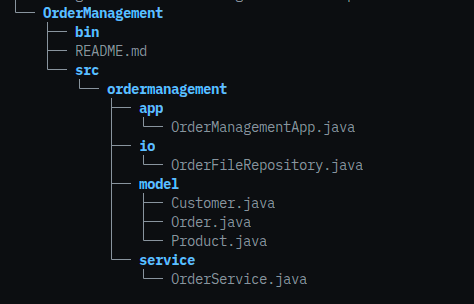

# Aufgaben zum Aufgabenblock IV WIN

##  1. Packages

### 1.1 Simples Package

Die Idee ist erstmal, ein sehr einfaches Package zu erstellen, um die 
Grundprinzipien zu verstehen. Jenachdem wo du programmierst, kann es ein bisschen
anders funktionieren, da IDEs unter Umständen schon einiges übernehmen. Aber um die 
Basis zu verstehen, machen wir in dieser Aufgabe ein Beispiel, dass auch ohne IDE
funktioniert. Die zu erstellende Ordnerstruktur sieht so aus:



### 1.1.1 Ordner-/Grundstruktur erstellen

- erstelle zunächst einen Projekt-Ordner namens Ordermanagement
- wechsle in diesen Ordner und erstelle jeweils auf der gleichen Ebene:
    - src - Ordner
    - bin - Ordner
- wechsel nun in den src Ordner => dieser ist der Source-Code Ordner, in dem nachher der
  Java-Code steht
- hier erstellen wir nun einen weiteren Ordner ordermanagement und wechsel ebenfalls in diesen ordner
- erstelle nun die entsprechenden Ordner und Files die in der Uebersicht stehen

### 1.1.2 Einfacher Beispiel-Code

Erstelle nun in den verschiedenen Ordnern simple Klassen.
Achte dabei darauf, das in den Models reine Model-Klassen
stehen, zum Beispiel so:


**Beispiel Models:**
```Java
package ordermanagement.model;

public class Customer {
    private int id;
    private String name;

    public Customer (int id, String name) {
        this.id = id;
        this.name = name;
    }

    public getId() {
        return this.id;
    }

    public getName() {
        return this.name;
    }
}
```

Wichtig ist hier, dass die erste Zeile immer die package 
Anweisung beinhaltet. 

**Beispiel app:**

Die OrderManagementApp.java File soll der Programm-Einstieg
sein und hier soll auch die Main-Funktion enthalten sein:

```java
// hier steht der package name
// hier stehen die benoetigten Imports
.
.
.

public class OrderManagementApp {
    public static void main (String[] args) {
        Customer customer = new Customer(1, "Mueller Gmbh");

        OrderService service = new OrderService();
        Order order = service.createOrder(customer, product, 2);

        order.printDetails();
    }
}
```

### 1.1.3 Kompilierung

Die Kompilierung erfolgt in diesem Beispiel ueber das Terminal. Hierfür wechselst du wieder in den Projektordner
und führst folgende Befehle aus:

**Kompilieren:**

`javac -d bin -sourcepath src src/ordermanagement/app/OrderManagementApp.java`

Im bin Ordner sollten nun die ganzen *.class Dateien entsprechend in den richtigen Unterordnern liegen.

**Ausführen:**

`java -cp bin ordermanagement.app.OrderManagementApp`

Wenn alles geklappt hat, sollte am Ende die Ausgabe deiner
`order.printDetails()` erscheinen. Falls nicht, gehe
systematisch auf Fehlersuche:

**Tipps Fehlersuche:**

- ist Kommandozeilen-Befehl richtig geschrieben
- sind die Ordner richtig benannt
- hast du die packages richtig definiert
- hast du jeweils die benoetigten imports gemacht und sind
  diese richtig geschrieben?
- sind alle benoetigten Methoden, Attribute usw. richtig
  definiert und geschrieben
- ist die main-Funktion richtig definiert und stimmen die 
  Beispiele (Daten-Formate usw.)

